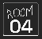

#  Room0️⃣4️⃣

A collection of small, fun projects collaborated on by the guys at Room04. 

## Languages and Technologies

We do not use one primary tech-stack. We use any stack with any language, with any other third-party technology all depending on the project at hand.

Commonly used languages and technologies include:

- JavaScript (React, Node)
- PHP
- Python (Flask)
- C++
- C#
- Flutter
- MySQL
- MSSQL
- MongoDB
